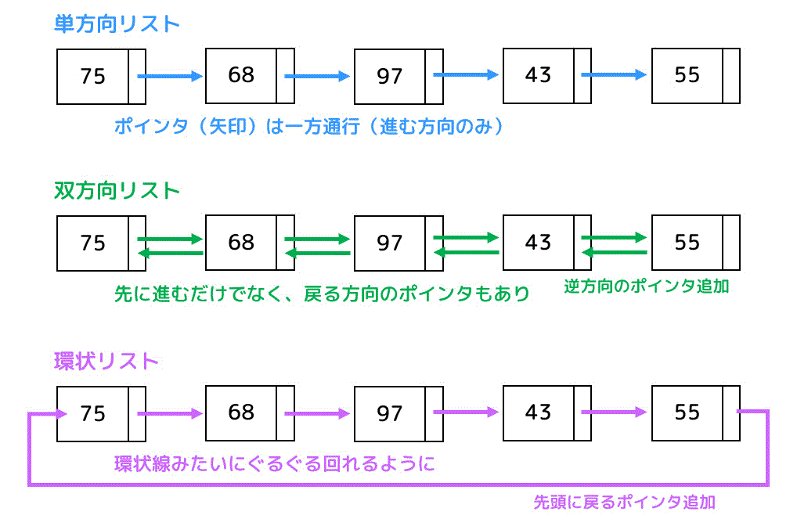

# 考えたアルゴリズム1
- HashMap<String URL, String Webページ>
に加えて、
- String[X] URLQue 
  - Xは定数
という配列を用意する。

これにアクセスしたURLを保存していく。

### 計算量の定義
- f(N) <= C
- Ω

- こっちの方が正確で良いかも
📌 https://blog.publictheta.com/articles/qCAEowAbozLeMcFreq73f

📌 https://rsk0315.hatenablog.com/entry/2021/10/13/235627#%E8%A8%88%E7%AE%97%E9%87%8F

### キューについて
📌 https://qiita.com/drken/items/6a95b57d2e374a3d3292

# 6/5 追記
## 連結リスト

- 双方向リストを使う